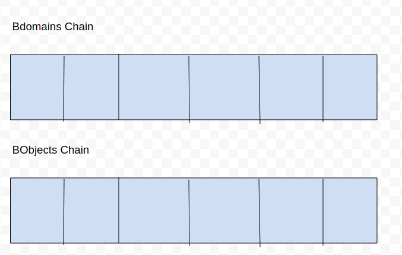

# recordchain
Chained database which stores users/teams/directory information, also ACL's capnp format on top of [0-db](https://github.com/zero-os/0-db)


# recordchain_py
implementation of recordchain in python

## INSTALL

make sure jumpscale 9.3 has been installed [see here](https://github.com/Jumpscale/core9)

```bash

js9 'j.tools.prefab.local.runtimes.golang.goraml()'
js9_code get --url "https://github.com/rivine/recordchain"
js9_code get --url "https://github.com/rivine/recordchain_py"

```



## Main entities 

### Blockchain
We have 2 separate chains 1 for bdomains and 1 for bobjects


### Bdomain (Blockchain Domain)
BDomains are stored in a blockchain
* id: incremental ID assigned to the domain.
* uid: unique id that stays the same even after modifications 
* name: human readable name for the domain.
* description: domain description
* mod_date: date of modification.
* author: domain creator id (int)
* signature: author signature.
* addr: address given by digital.me
* admins: ids of the admins of this domain.
* hash: (id+moddate+author+name+signature+owners(sorted)+addr+hash previous domain) 


### BObjects
Bobjects stored in their own separate chain
* id: incremental ID assigned to the object.
* uid: unique id that stays the same even after modifications (lookup table how does it practically works?)
* key: secret or key to access the data.
* domain: the domain where the bobject belongs.
* mod_date: date of modification.
* author: domain creator id (int)
* data: capnp data (User/Group/ACL/ACI)
* signature: author signature.
* hash: (id+domain+moddate+author+data+signature+hash previous bobject)
* compression_type: none, blosc, or snappy.
* acl:  link to acl object to allow someone access or not?


#### Types of Data stored in BObjects
##### User
Is stored in a bobject.

* uid: incremental id for user
* alias: list of names relevant to the groups the user is part of.
* key_pub: user public keys used for validation & encryption
* addr: mutable unique address given by the digital.me system
```
  example:
    id: 10    
    addr: "rabbit.luxor.egypt"
    alias:
    - "rabbit"
    - "gouny1"
```
##### Group
Is stored in BObject.

* uid: incremental id for group
* alias:  group names only relevant in all parent groups
* owners: list of owners ids which are people who administer this group and can add/remove users
* key_pub: list of public key which is used for validation & encryption
* addr: mutable unique address given by the digital.me system
```
  example:
    id: 10    
    addr: "rabbitgroup.luxor.egypt"
    owners: [1,2]
    alias:
    - "gig.engineering"
```
##### ACL
Access control list is also stored in bobject.
* uid: incremental id for ACL
* aci: list of ACI (Access Control Item) objects
* hash: md5 hash of concatenation of ACI hashes, used to find this acl to avoid duplicates (needs example)


##### ACI
Access Control Item is stored in BObject

* uid: incremental id for ACI
* groups: list of groups ids (sorted)
* users: list of users ids (sorted)
* right: freely interpreted by ACI users 
    >    text e.g. rwdl- (admin read write delete list -), freely to be chosen
        admin means all rights (e.g. on / = namespace or filesystem level all rights for everything)
        '-' means remove all previous ones (is to stop recursion), if group=0,user=0 then is for all users & all groups
* hash:  md5 of id+groups+users+right


## HOW TO USE

* create users and groups 
```python
    users = []
    for i in range(2):
        users.append(User('user%d'%i, "user%d pubkey"%i, "user%d.system.eg"%i))
    for i in range(2):
        users.append(User('user%d'%i, "user%d pubkey"%i, "user%d.system.be"%i))

    groups = []
    groups.append(Group('engineers_eg', [1], "gigengineering pubkey", "gig.engineering.eg"))
    groups.append(Group('salesmasters', [2,3], "sales pubkey", "sales.gig.be"))
```
* create manager for transactions and execute transactions
```python
    txs = []
    m = Manager()


    userbobjects_uids = []
    for i, g in enumerate(groups):
        tx = m.make_add_group_tx(author_id=1, name="obj%d"%i, data=dict(uid=g.uid, addr=g.addr, alias=[g.alias]))
        m.handle_tx(tx)

    for i, u in enumerate(users):
        tx = m.make_add_user_tx(author_id=1, name="obj%d"%i, data=dict(uid=u.uid, addr=u.addr, alias=[u.alias]))
        userbobjects_uids.append(m.handle_tx(tx))


    assert m.bobjectschain.tx_count == len(groups) + len(users)
    assert len(groups) + len(users) == len(m.users) + len(m.groups)
    
    m.summary()

    ## NOW WE REMOVE THE FIRST ADDED USER
    tx = m.make_delete_user_tx(uid=userbobjects_uids[0])
    m.handle_tx(tx)
    assert len(groups) + len(users) == len(m.users) + len(m.groups) + 1

    m.summary()

```

### Structure

`chain.py` has the block, transaction, blockchain simple implementation and the related signing/verifying functions 

```apptypes.py``` are the entities transactions will be working on 
We have some entities like BDomain, BObject, User `type` or `entity` that we execute all kinds of action on `add`, `update`, and `delete` and in typical tendermint app they are used to define the structure the transaction bytes marshaled from or unmarshaled to + the hashing definition.

```manager.py``` 

#### Application controller
we have 
* 2 separate chains for bdomains and bobjects.
and for the current application state we maintain 
* db0domains for bdomains state: dict of domain uid -> bdomain.
* db0objects for bobjects state: dict of object uid -> bobject.
* users for users state: user_id -> user_dict
* groups for groups state: group_id -> group_dict 
* acls for acls state: acl_id -> acl_dict 
* acis for acis state: aci_id -> aci_dict

Trying to follow tendermint application pattern to have check_tx, deliver_tx
for every action we have `make_action_name_tx` and `check_action_name_tx` and 

`make_action_name_tx` method should wrap action data into suitable transaction format.
```python    
def make_add_bdomain_tx(self, **kwargs):
    t = Transaction("add-bdomain", ACTION_DATA(**kwargs))
    return t
```

and `check_action_name_tx` should have the logic to check the validity of the action
for instance deleting bobject transaction while the bobjcet doesn't exist.

```python
def check_delete_bobject_tx(self, tx):
    domuid = tx.tdata.data['uid']
    return self.db0objects.get(domuid, False) 
```

and dispatching the transaction to the manager using `handle_tx` method 
```python
    m = Manager()
    tx_add1 = m.make_add_bdomain_tx(name="codescalers.egypt")
    tx_add2 = m.make_add_bdomain_tx(name="gig.uk")
    tx_add3 = m.make_add_bdomain_tx(name="gig.be")
    m.handle_tx(tx_add1)
    m.handle_tx(tx_add2)
    m.handle_tx(tx_add3)

    assert m.bdomainschain.tx_count == 3
    print(m.bdomainschain)
```


`tenderrecords` 
#### Application controller on tendermint
> Requires tendermint 0.14.0-'88f5f21d' and abci-cli 0.7.1 [Issue with the .proto files to work with the latest](https://github.com/davebryson/py-abci/issues/9)

Same as manager but using tendermint blockchain instead of the naive chain.

`python3 tenderrecords.py`

### Running tests
```pytest -s tests/tests.py```

### REST server
`server.py` a simple rest server built on flask-restufl exposes the transactions operations 

### queries.rest
example of rest calls to be executed compatible with [REST Client](https://github.com/Huachao/vscode-restclient)

### curltendermint.queries
Contains examples of transactions to be sent

